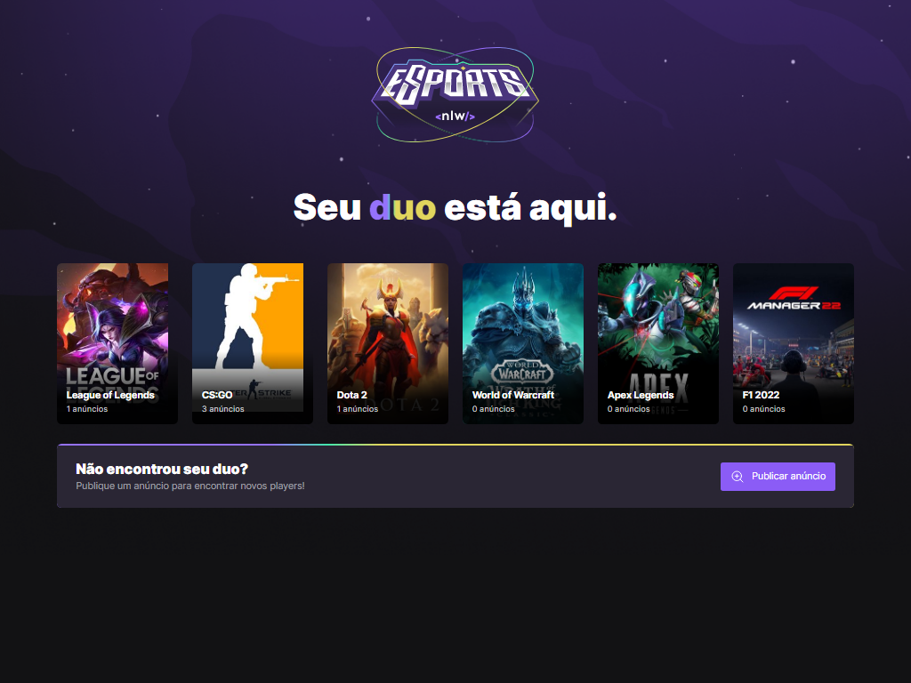
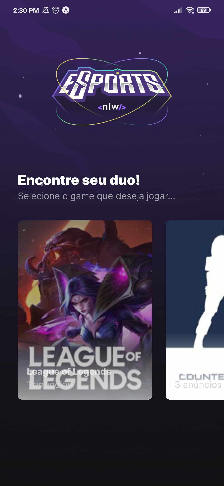
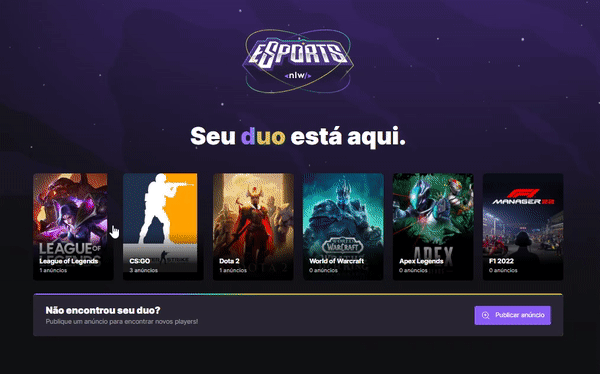
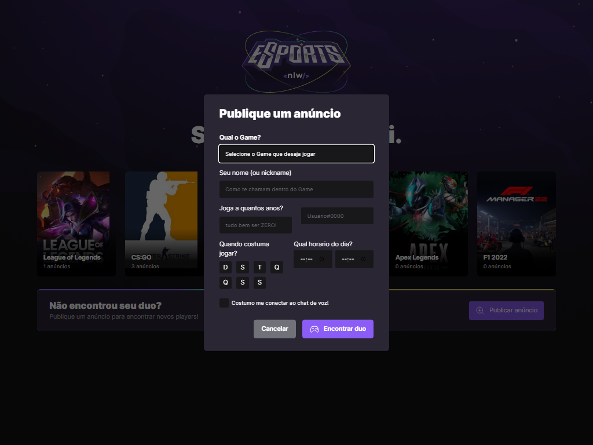
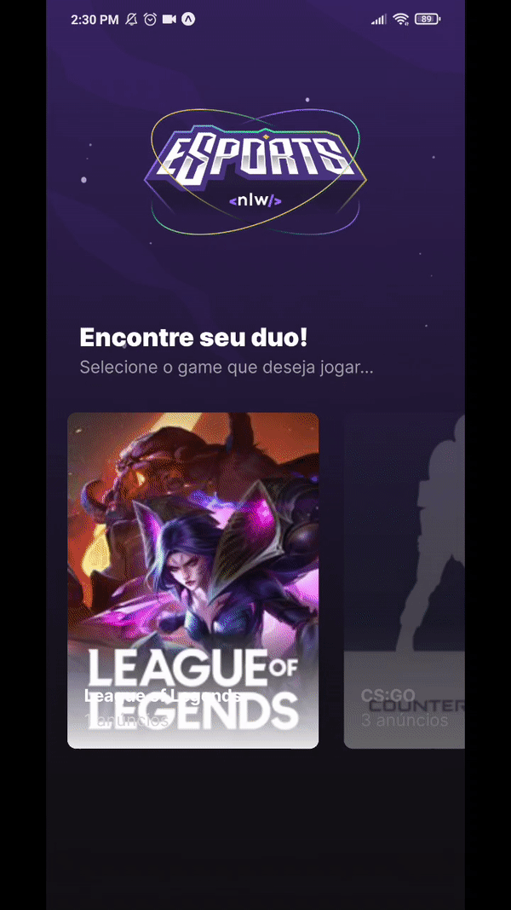
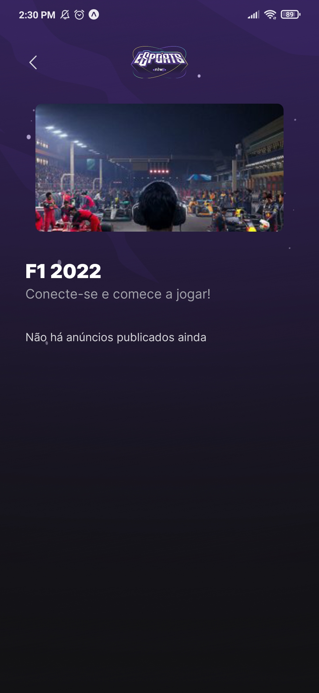
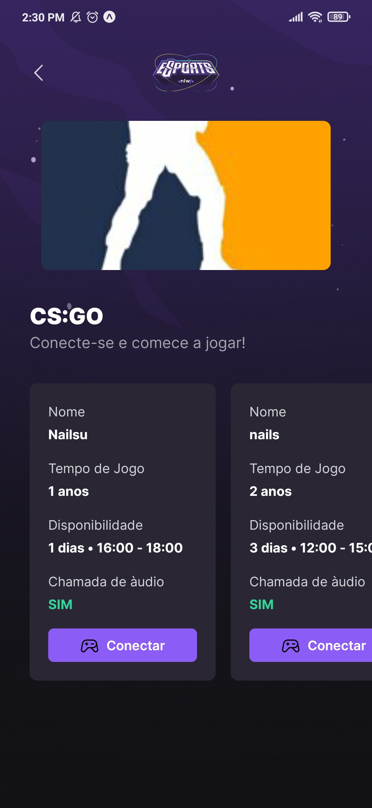

# *ESPORTS NLW* 🎮

    
Aplicação feita com a equipe da rocketseat

    Foi realmente uma experiência incrivel participar da NLW, excelentes ditadas e conteúdo
    de relevância para o mercado!!!

    
WEB

    

    
MOBILE

    

## 🎈Intuito

    Unir pessoas que estejam procurando um duo, ou apenas alguém para jogar casualmente!

## 🎈Funcionalidades

    <ul>
    <li>Buscar os games do backend e carregar as imagens da Twitch</li>
    <li>Cadastrar novos anúncios de duos</li>
    <li>Buscar anúncios e fazer a conexão via discord</li>
    <li>Melhorar o mundo :)</li>
    </ul>

## 🎈Descrição

    Foi decidido dividir as funcionalidades para mobile e web,
    assim a parte web ficou com a questão de cadastrar novos anúncios!
    E o mobile ficou responsável por unir os duos!

## 🔵WEB

## 🔴MOBILE

    

        
Rolagem simples pela nossa aplicação

        
        
Busca por duo, Match!😊

         
    

Obs: Bordas pretas por detalhe de gravação, não aparecem no dispositivo

A seguir, game sem e com anúncio públicado: 

THANKS :)

